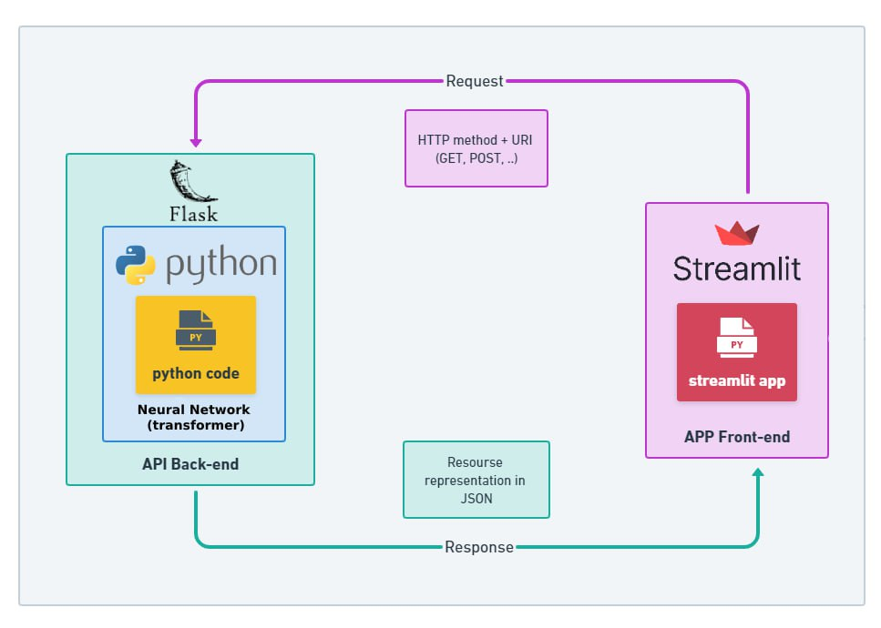
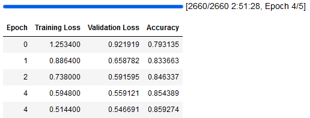
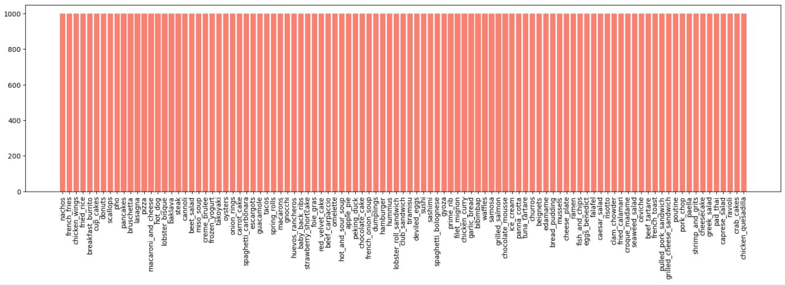
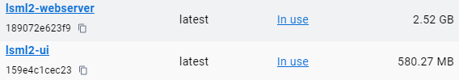
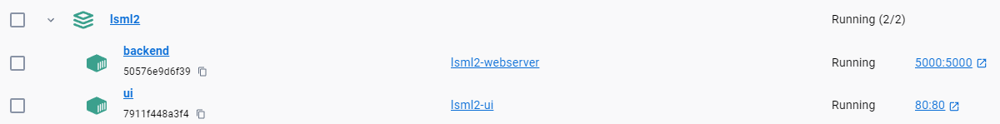
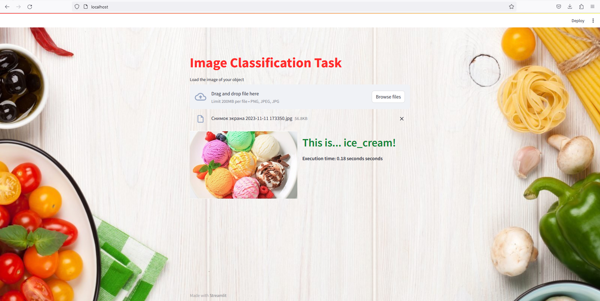

    

# LSML2 Final Project

## «Fine-tuning of VIT-model on Food-101 Dataset»

### 1. Project documentation

lsml2/ 
├─figures/ 
├─flask/ 
│ ├─Dockerfile 
│ ├─food101_vit.py 
│ └─requirements.txt 
├─samples/ 
├─streamlit/ 
│ ├─Dockerfile 
│ ├─background.jpg 
│ ├─requirements.txt 
│ └─ui.py 
├─ FOOD101_Train.ipynb 
├─ README.md 
└─docker-compose.yml 

#### 1.1. Design document, architecture

* Architecture Schema:

#### 1.2. Run instructions (env, commands)

**1.** Git clone 

    https://github.com/DmitriyPonomarenko/lsml2.git

**2.** Docker-compose up

    docker-compose up --build

**3.** Use these links:

**Flask: Test for backend**

    curl -X POST -F "file=@<path_to_your_file>" http://localhost:5000/predict

**Streamlit:**

    http://localhost/

**4. Usage Samples:** try some images yourself

    https://github.com/DmitriyPonomarenko/lsml2/tree/main/samples

#### 1.3. Losses, metrics

There was used transfer learning and adoptation of the [VIT-model](https://huggingface.co/google/vit-base-patch16-224) to our downstream task with food. 
The model has high accuracy of 89.38%. Learning was performed with GPU RTX 3050 8GB.

### 2. Data set

* [Vision Transformer (ViT) model](https://huggingface.co/google/vit-base-patch16-224) pre-trained on ImageNet-21k (14 million images, 21,843 classes) at resolution 224x224, and fine-tuned on ImageNet 2012 (1 million images, 1,000 classes) at resolution 224x224.
* [The Food-101 Data Set](https://data.vision.ee.ethz.ch/cvl/datasets_extra/food-101/): a challenging data set of 101 food categories, with 101'000 images. For each class, 250 manually reviewed test images are provided as well as 750 training images. On purpose, the training images were not cleaned, and thus still contain some amount of noise. This comes mostly in the form of intense colors and sometimes wrong labels. All images were rescaled to have a maximum side length of 512 pixels.
* our target is multi-class and is balanced:

### 3. Model training code
#### 3.1. Jupyter Notebook

* [IPYNB with training](https://github.com/DmitriyPonomarenko/lsml2/blob/main/FOOD101_Train.ipynb)

### 4. Service deployment and usage instructions
#### 4.1. Docker-compose file

* Images: 

* Containers: 

#### 4.2. Client for service

* User Interface is implemented on [Streamlit](https://streamlit.io/). User upload his\her image, and it will be sent to Flask by POST-request;

* Possible requests per second is on average RPS≈9

#### 4.3. Backend architecture

Backend architecture is done by Flask. It recieves a user's image from UI, make prediction (one of 101 classes) via our VIT-model which was adopted to the downstream task and returns it back to UI.

#### 4.4. Model

* model was fine-tuned up to 3 hours;
* the final size of [pytorch files](https://github.com/DmitriyPonomarenko/lsml2/releases/tag/v1.0.0) are 328 MB
* The achieved result of 89.38% accuracy exceeds the baseline of 56.40% [CNN, 2014](https://data.vision.ee.ethz.ch/cvl/datasets_extra/food-101/static/bossard_eccv14_food-101.pdf) 
